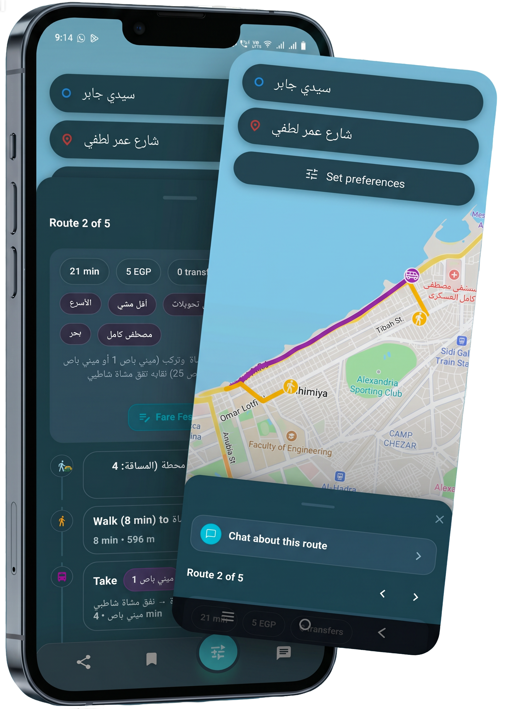
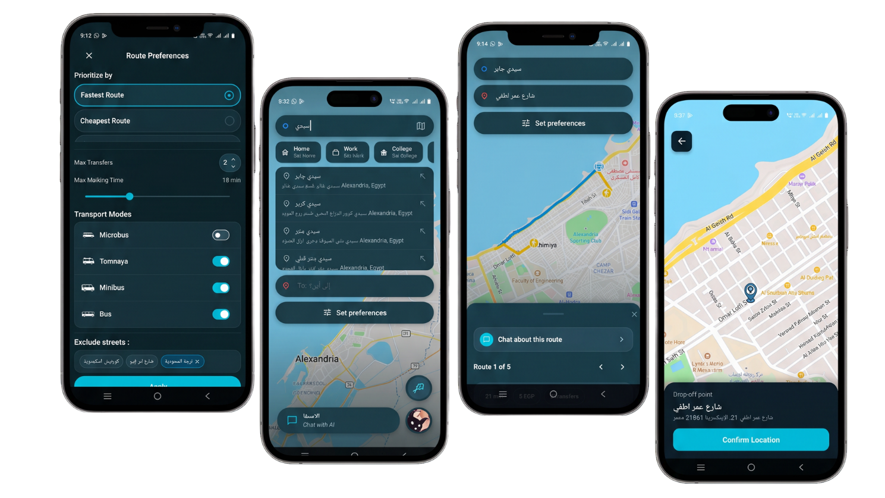
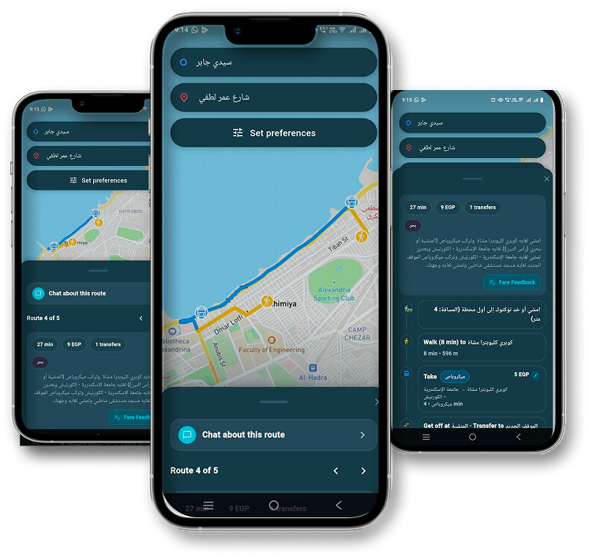
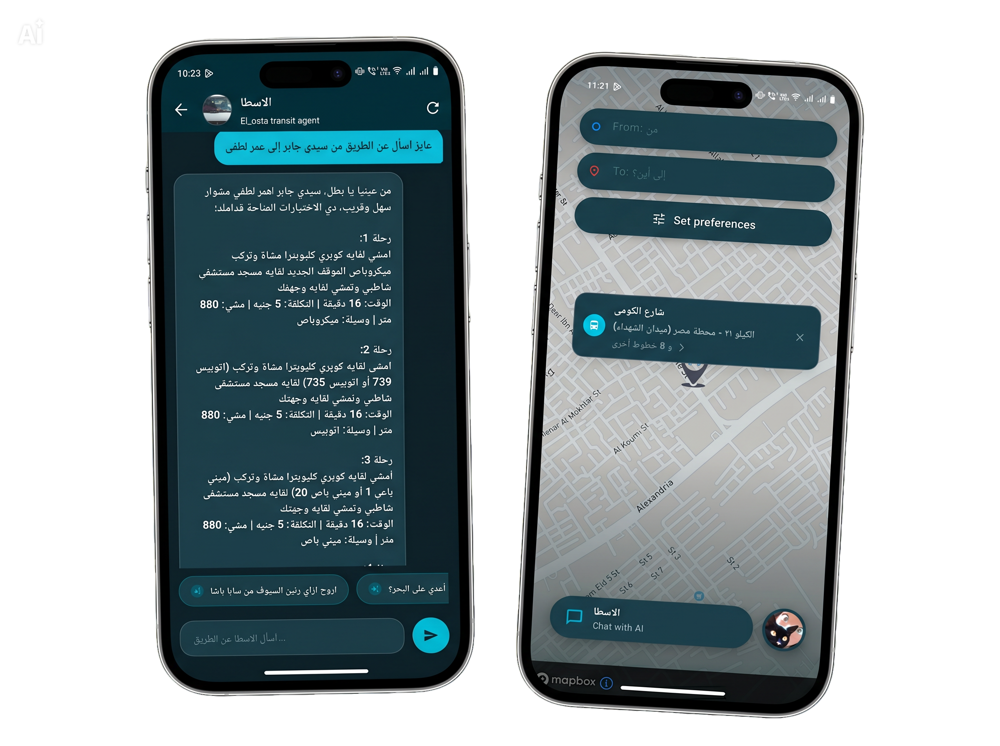
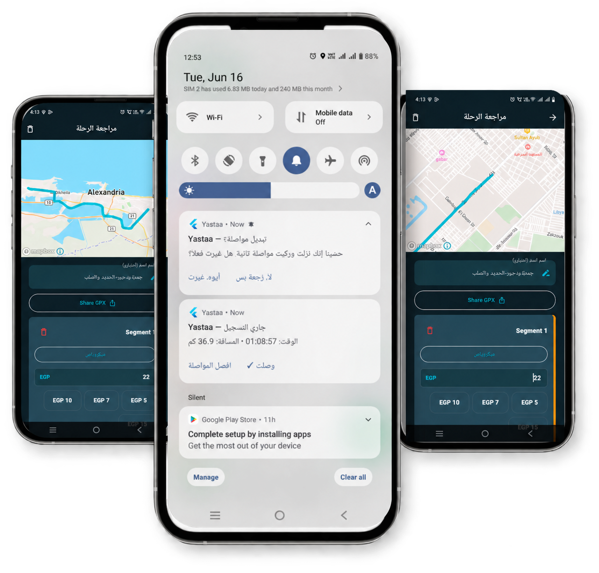
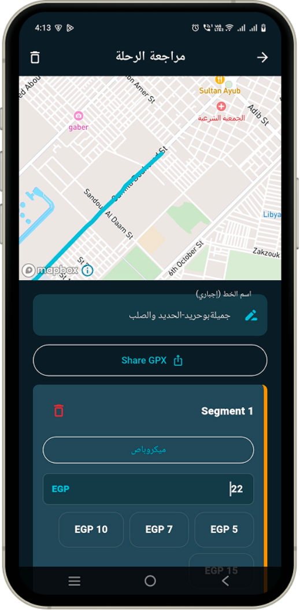

# Yastaa - يسطا

Yastaa is a Flutter mobile application for transit discovery, route planning, and GPS-based crowdsourcing in Egypt. The app combines map-driven trip planning, route preference controls, nearby trip discovery, Supabase-backed authentication, an AI assistant, fare feedback, and route recording with GPX export.

## Product Summary

The project was built to solve a real mobility problem: helping users discover routes and also contribute transport data back into the system. That means Yastaa is not just a routing app. It is also a collection, review, and export pipeline for transit traces, with a focus on clean separation of concerns and maintainable code.

## App Walkthrough

### Plan a trip from the map

Yastaa starts with a map-first home screen where riders can enter an origin and destination, adjust route preferences, and browse alternative journeys. The route cards make it easy to compare options while keeping the selected path visible on the map.

<p align="center">
  
</p>

### Choose locations and preferences

Users can select precise pickup and destination points, switch between map-based selection and search, and refine the journey with their preferred transport options. These controls let the planner tailor results to how a rider wants to travel.

<p align="center">
  
</p>

### Review route alternatives

The results view shows the route on an interactive map alongside a readable step-by-step itinerary. Riders can move through route alternatives, see walking and transfer legs, and open the in-app assistant for help with a selected trip.

<p align="center">
  
</p>

### Ask the transit assistant

The AI assistant provides a chat interface for transit questions and route-specific guidance, while preserving quick access to the current journey on the map.

<p align="center">
  
</p>

### Crowdsource fares and GPS traces

Yastaa lets riders contribute fare feedback and record journeys as they travel. GPS recording continues through a background service, while the contribution flow captures route details, segments, and fare information for community-powered transit data.

<p align="center">
  
</p>

### Review and share recorded trips

After recording, the trip review screen displays the captured path, organizes the trip into segments, and can export the result as a GPX file for sharing or submission.

<p align="center">
  
</p>

## What The App Does

- Finds and displays routes on a live map.
- Lets users choose origin and destination points through a map picker.
- Applies route preferences so trips can be optimized by user priorities.
- Shows nearby transit options and route-related information.
- Provides an AI assistant for transit questions.
- Supports Google sign-in through Supabase.
- Lets users submit fare feedback for crowdsourcing.
- Records GPS trips in the background, finalizes them into GPX files, and opens a review flow before submission.

## Architecture

Yastaa follows a clean architecture style with strong single responsibility boundaries.

### Core Principles

- Single responsibility: each service, cubit, and widget has one clear purpose.
- Reusable widgets: shared UI pieces are extracted instead of duplicated across screens.
- Feature separation: routing, preferences, agent chat, crowdsourcing, and auth are isolated into their own modules.
- Infrastructure isolation: networking, storage, routing, and dependency injection live in `lib/core/`.

### Layering

- `lib/core/` contains app-wide infrastructure such as config, networking, routes, services, storage, and theme.
- `lib/features/` contains the business modules and domain logic.
- `lib/presentation/features/` contains the user-facing screens and reusable interface widgets.

This structure keeps the app scalable and easier to reason about as features grow.

## Networking And Backend

The app talks to a backend deployed on Azure Container Apps. The production base URL is centralized in the codebase and used by the routing and API clients, which keeps requests consistent across the app.

### Dio Interceptors

HTTP traffic is built around `Dio` with interceptors so network behavior stays reusable and testable.

- `SupabaseAuthInterceptor` attaches the current Supabase JWT as `Authorization: Bearer <token>` when a request should be authenticated.
- If a request already carries its own authorization header, the interceptor respects it and does not overwrite it.
- On a `401` response, the interceptor forces a Supabase session refresh once and retries the request.

This design keeps auth handling out of feature code and inside reusable infrastructure.

## Authentication

Authentication is managed through Supabase.

- The app initializes Supabase at startup.
- Google sign-in is completed through the `AuthService` layer.
- The user session is monitored and proactively refreshed before expiry.
- Access tokens are retrieved from Supabase and reused by the network layer.
- The auth service keeps a refresh schedule active so requests are less likely to fail during backend cold-start windows.

In practice, this means the UI never deals directly with token attachment or refresh logic. The auth service owns that responsibility.

## GPS Recording And GPX Export

One of the most important parts of the project is route recording.

### Recording Flow

- The recording feature runs with a background service.
- GPS points are collected while the user is traveling.
- Segments are created when the user changes mode or when the system detects a potential transfer.
- Local persistence keeps active trip state, raw GPS points, and transfer metadata safe until finalization.

### Finalization Flow

- When a trip stops, `TripFinalizerService` loads the recorded points.
- It preserves short or incomplete trips for review instead of discarding them.
- It calculates trip distance and enriches the metadata with segment point counts.
- It generates a GPX file through `GpxBuilderService`.
- The generated file is stored in the app documents directory and linked to the trip metadata.
- The trip is then moved into the pending review state.

### GPX Export

The GPX builder produces a standards-based XML file with:

- trip metadata
- segment data
- timestamps
- accuracy information
- transfer annotations
- privacy-aware coordinate fuzzing

The review screen can preview the generated GPX path and share it using the platform share sheet. That makes the route recording flow useful both for internal review and for external submission.

## Feature Breakdown

### Home And Routing

The home experience is the primary transit workspace. It handles map interaction, route search, journey summaries, nearby route discovery, and routing actions.

### Preferences

The preferences feature lets users express route priorities and adjust how trips are selected. The logic is isolated so the routing layer can consume preference rules without coupling them to UI code.

### Map Picker

The map picker is a focused screen for selecting locations accurately. It is used wherever the app needs a precise origin or destination.

### Auth And Profile

The auth flow covers Google sign-in, session display, and user profile interactions. The session token view is also useful for debugging backend authentication during development.

### AI Assistant

The agent feature provides a chat-style interface for transit assistance and route-related questions.

### Fare Crowdsourcing

The fare feedback flow collects user-reported fares so transport pricing data can be improved over time.

### GPS Crowdsourcing

This is the most technical feature in the app. It records trips, manages segment transitions, handles GPS loss or auto-pause states, creates GPX exports, and opens review screens before the trip is finalized.

## Project Structure

```text
nextstation/
├── lib/
│   ├── core/                     # Shared infrastructure and app-wide utilities
│   │   ├── config/               # Environment and map configuration
│   │   ├── constants/            # Shared strings, colors, and labels
│   │   ├── di/                   # Dependency injection setup
│   │   ├── network/              # API clients, interceptors, and error handling
│   │   ├── routes/               # Router setup and route guards
│   │   ├── services/             # Reusable services such as auth, location, and storage
│   │   ├── storage/              # Hive helpers and local persistence
│   │   └── theme/                # Theme and visual system
│   ├── features/                 # Business features and domain logic
│   │   ├── agent/                # AI assistant
│   │   ├── crowdsourcing/        # Fare feedback
│   │   ├── gps_routes_crowdsourcing/  # Recording, GPX export, review, and contributions
│   │   ├── nearby_trips/         # Nearby trip logic
│   │   ├── preferences/          # Route preference builders
│   │   └── routing/              # Route planning and API contracts
│   ├── presentation/             # User interface screens and widgets
│   │   └── features/             # Home, auth, splash, preferences, map picker, etc.
│   └── main.dart                 # App entry point
├── assets/                       # Images and icons
├── android/                      # Android platform config
├── ios/                          # iOS platform config
├── linux/                        # Linux desktop config
├── macos/                        # macOS desktop config
├── web/                          # Web entry files
└── windows/                      # Windows desktop config
```

## Tech Stack

- Flutter and Dart
- `flutter_bloc` for state management
- `go_router` for navigation
- `mapbox_maps_flutter` for map rendering
- `dio` for networking
- `supabase_flutter` for authentication and session handling
- `flutter_background_service` for GPS recording
- `hive` and `shared_preferences` for local persistence
- `geolocator` and `geocoding` for location support
- `path_provider` and `share_plus` for GPX file handling and sharing

## Setup

1. Install dependencies.

   ```bash
   flutter pub get
   ```

2. Create a `.env` file in the project root.

   ```env
   MAPBOX_ACCESS_TOKEN=pk.your_mapbox_token_here
   ENVIRONMENT=development
   ```

3. Run the app.

   ```bash
   flutter run
   ```

## Build

Android APK:

```bash
flutter build apk --release
```

Android App Bundle:

```bash
flutter build appbundle --release
```

iOS release build:

```bash
flutter build ios --release
```

## Notes

